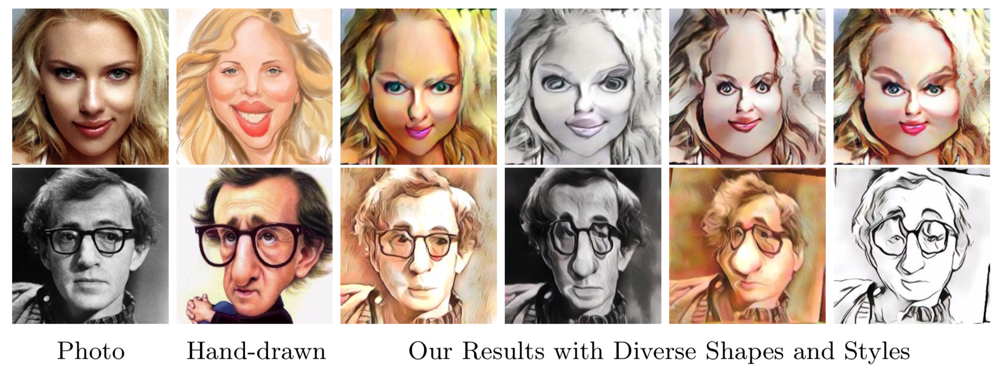

# Semantic-CariGANs
Code for "Learning to Caricature via Semantic Shape Transformation"

## Authors
Wenqing Chu, Wei-Chih Hung, Yi-Hsuan Tsai, Yu-Ting Chang, Yijun Li, Deng Cai, Ming-Hsuan Yang

## Dataset
- [Webcaricature](https://cs.nju.edu.cn/rl/WebCaricature.htm): contains the photos and caricatures.

## Introduction
Caricature is an artistic drawing created to abstract or exaggerate facial features of a person. Rendering visually pleasing caricatures is a difficult task that requires professional skills, and thus it is of great interest to design a method to automatically generate such drawings. To deal with large shape changes, we propose an algorithm based on a semantic shape transform to produce diverse and plausible shape exaggerations. Specifically, we predict pixel-wise semantic correspondences and perform image warping on the input photo to achieve dense shape transformation. We show that the proposed framework is able to render visually pleasing shape exaggerations while maintaining their facial structures. In addition, our model allows users to manipulate the shape via the semantic map. We demonstrate the effectiveness of our approach on a large photograph-caricature benchmark dataset with comparisons to the state-of-the-art methods.

The image below shows some example results of our method:



## Dependency
- PyTorch >= 0.4.1
- Python = 3.6

## Usage
Our method has four parts, segmentation, retrieval, shape transformation and style transfer.
We provide the pretrained segmentation, retrieval, style adaptation and shape adaptation models in Google Drive (https://drive.google.com/open?id=1x0bJ7wBAsC_jSjm30SIqjl-huuBZMKh6)
Please put the models under 'Semantic-CariGANs/'.
For testing options, please use an aligned photo image and run the below commond. Refer to 'options/test_options.py' for testing setting and details.

Given the shape and style images, please use this command:
```
python predict.py --name parseref_gan --input examples/photo_examples/Woody_Allen_P00002.jpg --shape examples/cari_gallery/parsing_maps_gallery/005151.png --style_path examples/style_imgs/Alan_Rickman_C00013.jpg
```
Given the style image, please use this command to perform retrieval, shape transformation and style translation:
```
python predict.py --name parseref_gan --input examples/photo_examples/Scarlett_Johansson_P00002.jpg
```

We follow [CariFaceParsing](https://github.com/ZJULearning/CariFaceParsing) to perform face parsing and provide the pretrain model in checkpoints/parsing.pth.

For retrieval, please go to 'Semantic-CariGANS/retrieval/' and use this command:
```
python train_siamese.py
```
For shape transformation, please go to 'Semantic-CariGANS/' and use this command:
```
python train.py --dataroot ./datasets/carigan/ --name parseref_gan --input_nc 10 --output_nc 10 --dataset_mode parseref --batch_size 32 --model parseref_gan
```
For style translation, please go to 'Semantic-CariGANS/AdaIN' and use this command: 
```
python train.py --content_dir <content_dir> --style_dir <style_dir>
```


## Reference
Please cite our paper if you find it useful for your research.

@article{Chu2020Learning,
    title={Learning to Caricature via Semantic Shape Transformation},
    author={Chu, Wenqing and Hung, Wei-Chih and Tsai, Yi-Hsuan Chang, Yu-Ting and Li, Yijun and Cai, Deng and Yang, Ming-Hsuan},
    year={2020},
}


## Acknowledgment
This code is heavily borrowed from
- [PyTorch-Encoding](https://github.com/zhanghang1989/PyTorch-Encoding)
- [CycleGan](https://github.com/junyanz/pytorch-CycleGAN-and-pix2pix)
- [pytorch-AdaIN](https://github.com/naoto0804/pytorch-AdaIN)
- [CariFaceParsing](https://github.com/ZJULearning/CariFaceParsing)
